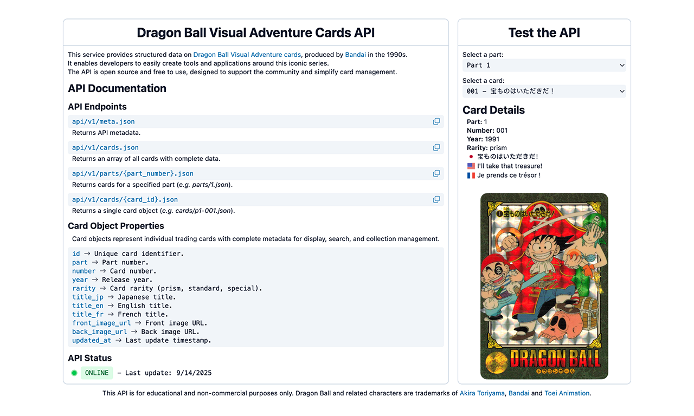
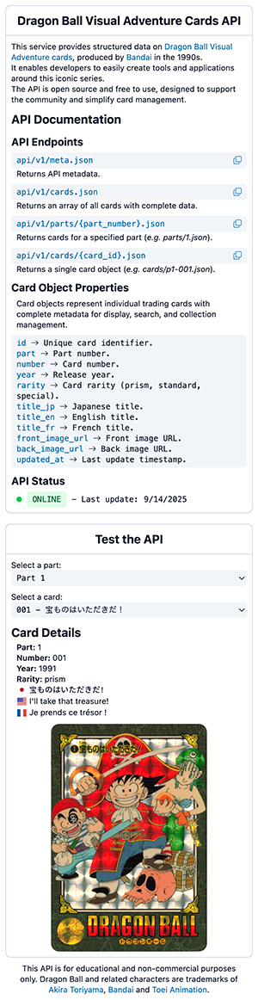

# Dragon Ball Visual Adventure Cards API

## Description

The Dragon Ball Visual Adventure Cards API provides structured data on the collectible cards released by Bandai in the 1990s.

It is open-source, free to use, and designed for developers, collectors, and enthusiasts seeking easy access to card metadata.

This API helps you search, filter, and organize cards without having to manually manage data from physical collections.

This API is for educational and non-commercial purposes only.

Dragon Ball and all related characters are trademarks of Akira Toriyama, Bandai, and Toei Animation.

## Objectives

- Provide complete metadata for Dragon Ball Visual Adventure cards.
- Allow developers to re trieve card information programmatically.
- Support collectors in tracking, sorting, and displaying their collections.
- Maintain an open-source resource for the Dragon Ball community.

## Tech Stack


## File Description

| **FILE**            | **DESCRIPTION**                                                                         |
| :-----------------: | --------------------------------------------------------------------------------------- |
| `assets`            | Contains the resources required for the repository.                                     |
| `api`               | Contains the generated API files and endpoint logic.                                    |
| `data`              | Contains CSV files with the collection data for all Dragon Ball Visual Adventure cards. |
| `schema`            | Defines the schema used to structure and validate the card data.                        |
| `test`              | Contains unit tests and scripts to validate API functionality.                          |
| `build.mjs`         | Script used to generate the API from the CSV data and schema.                           |
| `index.html`        | API documentation landing page.                                                         |
| `package.json`      | Defines the Node.js project, dependencies, and scripts.                                 |
| `package-lock.json` | Automatically generated file to lock installed NPM dependency versions.                 |
| `.github`           | Contains GitHub Actions workflows to automate API generation and testing.               |
| `.gitignore`        | Specifies files and folders to be ignored by Git.                                       |
| `README.md`         | The README file you are currently reading 😉.                                           |

## Installation & Usage

### Installation

1. Clone this repository:
    - Open your preferred Terminal.
    - Navigate to the directory where you want to clone the repository.
    - Run the following command:

```
git clone https://github.com/fchavonet/web-db_visual_adventure_cards_api.git
```

2. Open the cloned repository.

3. Install dependencies:

```
npm install
```

4. Run tests to verify the installation:

```
npm run test
```

5. Build the API from the CSV data:

```
npm run build
```

> After building, the generated API will be available in the `api/` folder.

### Usage

1. Open `index.html` in a browser to access the API documentation and a basic demonstration.

You can also test the project online by clicking [here](https://fchavonet.github.io/full_stack-db_visual_adventure_cards_api/). 

<table>
    <tr>
        <th align="center" style="text-align: center;">Desktop view</th>
        <th align="center" style="text-align: center;">Mobile view</th>
    </tr>
    <tr valign="top">
        <td align="center">
            <picture>
                
            </picture>
        </td>
        <td align="center">
            <picture>
                
            </picture>
        </td>
    </tr>
</table>

## What's Next?

- Complete the card database with all missing entries.
- Replace low-quality card images with higher-resolution versions.
- Develop a mobile application to allow users to track and manage their card collection.

## Thanks

- Special thanks to Ninjalex for assisting with database development.
- Thanks to all contributors and the Dragon Ball fan community for supporting this project.

## Author(s)

**Fabien CHAVONET**
- GitHub: [@fchavonet](https://github.com/fchavonet)
