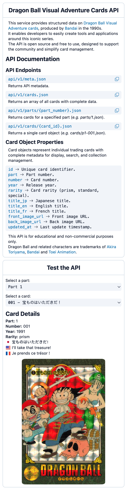

# Dragon Ball Visual Adventure Cards API

## Table of contents

<details>
    <summary>
        CLICK TO ENLARGE 😇
    </summary>
    <a href="#description">Description</a>
    <br>
    <a href="#objectives">Objectives</a>
    <br>
    <a href="#tech-stack">Tech stack</a>
    <br>
    <a href="#files-description">Files description</a>
    <br>
    <a href="#installation_and_how_to_use">Installation and how to use</a>
    <br>
    <a href="#whats-next">What's next?</a>
    <br>
    <a href="#thanks">Thanks</a>
    <br>
    <a href="#authors">Authors</a>
</details>

## <span id="description">Description</span>

The Dragon Ball Visual Adventure Cards API provides structured data on the collectible cards released by Bandai in the 1990s.

It is open-source, free to use, and designed for developers, collectors, and enthusiasts who want easy access to card metadata.
<br>
This API helps you search, filter, and organize cards without having to manually manage data from physical collections.

This API is for educational and non-commercial purposes only.
<br>
Dragon Ball and all related characters are trademarks of Akira Toriyama, Bandai, and Toei Animation.

## <span id="objectives">Objectives</span>

- Provide complete metadata for Dragon Ball Visual Adventure cards.
- Allow developers to retrieve card information programmatically.
- Support collectors in tracking, sorting, and displaying their collections.
- Maintain an open-source resource for the Dragon Ball community.

## <span id="tech-stack">Tech stack</span>

<p align="left">
    
    
    
    
    
    
    
    
    
</p>

## <span id="files-description">Files description</span>

| **FILES**           | **DESCRIPTION**                                                                         |
| :-----------------: | --------------------------------------------------------------------------------------- |
| `assets`            | Contains the resources required for the repository.                                     |
| `api`               | Contains the generated API files and endpoint logic.                                    |
| `data`              | Contains CSV files with the collection data for all Dragon Ball Visual Adventure cards. |
| `schema`            | Defines the schema used to structure and validate the card data.                        |
| `test`              | Contains unit tests and scripts to validate the API functionality.                      |
| `build.mjs`         | Script used to generate the API from the CSV data and schema.                           |
| `index.html`        | API documentation landing page.                                                         |
| `package.json`      | Defines the Node.js project, dependencies, and scripts.                                 |
| `package-lock.json` | Automatically generated file to lock the installed NPM dependencies versions.           |
| `.github`           | Contains GitHub Actions workflows to automate API generation and testing.               |
| `.gitignore`        | Specifies files and folders to be ignored by Git.                                       |
| `README.md`         | The README file you are currently reading 😉.                                           |

## <span id="installation_and_how_to_use">Installation and how to use</span>

### Installation:

1. Clone this repository:
    - Open your preferred Terminal.
    - Navigate to the directory where you want to clone the repository.
    - Run the following command:

```bash
git clone https://github.com/fchavonet/web-db_visual_adventure_cards_api.git
```

2. Open the repository you've just cloned.

3. Install dependencies:

```bash
npm install
```

4. Run tests to verify the setup:

```bash
npm run test
```

5. Build the API from the CSV data:

```bash
npm run build
```

> After building, the generated API will be available in the `api/` folder.

### How to use:

1. Open `index.html` in a browser to access the API documentation and a basic demonstration of possible API usage.

You can also test the web application online by clicking [here](https://fchavonet.github.io/web-db_visual_adventure_cards_api/). 

<table>
    <tr>
        <th align="center" style="text-align: center;">Desktop view</th>
        <th align="center" style="text-align: center;">Mobile view</th>
    </tr>
    <tr valign="top">
        <td align="center">
            <picture>
                
            </picture>
        </td>
        <td align="center">
            <picture>
                
            </picture>
        </td>
    </tr>
</table>

## <span id="whats-next">What's next?</span>

- Complete the card database with all missing entries.
- Replace card images that are of low quality with higher resolution versions.
- Develop a mobile application to allow users to track and manage their card collection.

## <span id="thanks">Thanks</span>

- Special thanks to Ninjalex for assisting with the development of the database.
- Also thanks to all contributors and the Dragon Ball fan community for supporting this project.

## <span id="authors">Authors</span>

**Fabien CHAVONET**
- GitHub: [@fchavonet](https://github.com/fchavonet)
